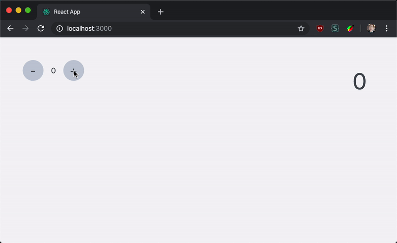
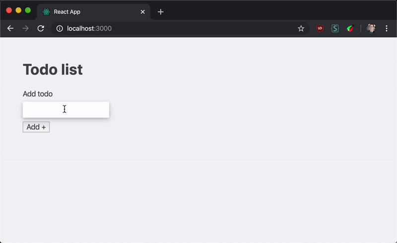

# Learn Advanced React: state management with context

We're going to learn how to manage global application state with React context.

## Learning outcomes

- [ ] Why we might want to avoid "prop drilling"
- [ ] Using context to access global state
- [ ] Centralising state updates with reducers
- [ ] Using custom hooks to create Redux-like abstractions

## Part 0: setup

1. Clone this repo
1. `cd` into it and run `npm install`
1. Run `npm start` and it should automatically open in your browser

You should see a counter that lets you increment and decrement a number. The app also displays a large copy of the count separately at the top right.



## Part 1: find the bug

Open `src/Counter.js`. It contains quite a few small components. Our `count` state has to live at the top-level component as it is needed in both branches of the component tree: inside `Counter` _and_ `BigCount`.

There's a bug in here somewhere: if you try the UI you should see that something doesn't work.

### Task

Find the bug and fix it so the counter works as expected.

## Prop drilling

Since there are several levels of nesting we have to pass our state down via props through multiple components. This is often called "prop drilling". It can be both annoying and a source of bugs, as we just discovered.

We can avoid doing this using React context.

## React context

Usually the only way for a component to use values from elsewhere in the component tree is if they are passed in as props. Context lets us bypass this and directly access values from further up the tree.

### Creating context

We can create a context like this:

```jsx
import React from "react";

const MyContext = React.createContext();
```

### Providing context

We now need to _provide_ a value to a component tree using this context. The context object contains a `.Provider` property, which is a component we can use to do this:

```jsx
import React from "react";

const MyContext = React.createContext();

function App() {
  return (
    <MyContext.Provider value={{ test: 5 }}>
      <Child />
    </MyContext.Provider>
  );
}
```

We pass whatever we want children to be able to access to the provider using its `value` prop.

### Accessing context

Any children within the provider can now access the context value using the `React.useContext()` hook.

```jsx
import React from "react";

const MyContext = React.createContext();

function App() {
  // ...
}

function Child() {
  const { test } = React.useContext(MyContext);
  return <div>{test}</div>;
}
```

**Important**: the child needs access to the original context variable so that `useContext` knows what value to get. If the context is defined in a different file you should export it so that children can import it and use here.

## Part 2: context refactor

Now we know how to use context we can solve our prop drilling problem in our counter.

### Task

Refactor your `src/Counter.js` components to use context to pass `count` and `setCount`. You shouldn't need to pass any props at all.

## Centralising updates with reducers

Open `src/Todos.js`. This is a todo-list application that renders an array of todos that the user can add to and mark as complete.



The state updates are currently spread across the various components. This makes it hard to see at a glance what updates are possible and how they work, even for a small app like this with only two types of updates.

It's sometimes useful to centralise state updates so they are all managed in one place. We can use the `React.useReducer()` hook for this.

### `useReducer`

This hook is similar to `React.useState()`. We pass it our initial state value, _and_ a "reducer" function. It returns our state and a special `dispatch` function used to update the state. You can read more [in the docs](https://reactjs.org/docs/hooks-reference.html#usereducer).

```jsx
function Counter() {
  const [count, dispatch] = React.useReducer(0, reducer);
  return <div>{count}</div>;
}
```

### The reducer

A reducer is a function that receives state and an "action" as arguments, then returns the new state based on the action. The convention is for the action to be an object with a `type` property that determines how the state updates. It can also have a `payload` property with data required for the update.

Lets look at the counter example.

```js
function reducer(state, action) {
  switch (action.type) {
    case "increment":
      return state + 1;
    case "decrement":
      return state - 1;
    case "custom_amount":
      return state + action.payload;
  }
}
```

This function uses a switch statement to describe all the possible actions that can update the state.

### `dispatch`

When the `dispatch` function is triggered it will call the reducer with the current state and whatever action was passed in. If we wanted to increment the count state above we would call `dispatch({ type: "increment" })`. We can pass extra properties in here too. For example this `dispatch({ type: "custom_amount", payload: 10 })` will increment the count by 10.

## Part 3: reducer refactor

It would be nice to centralise the state updates for our todo list.

### Task

Use the `React.useReducer()` hook to move all the state updates in `src/Todos.js` into one place. You'll need to pass `dispatch` down via props instead of `setTodos`.

## Part 4: reducers and context

We still have the prop drilling problem here: we have to pass `dispatch` and our state down via props. It's not too bad here but if we wanted to break this component up more it might get unwieldly. The [React docs actually recommend this pattern](https://reactjs.org/docs/hooks-faq.html#how-to-avoid-passing-callbacks-down) for deep updates.

### Task

Use context to pass your state and `dispatch` down without passing any props.

## Part : "Redux" hooks

The popular state management library Redux uses context to store your state globally, with reducer functions to handle updates to it.

It also uses custom hooks to expose this state object and a `dispatch` function (which works just like the built-in React one).

For example the `useSelector()` hook allows you to pass in a function that selects just the slice of your state object you want.

```jsx
function App() {
  const other = useSelector(state => state.thing.other);
  return <div>{other}</div>;
}
```

The `useDispatch()` hook makes it easy for components to trigger state updates:

```jsx
function App() {
  const dispatch = useDispatch();
  return <button onClick={() => dispatch({ type: "thing" })}>Click me</button>;
}
```

### Custom hooks

> A custom Hook is a JavaScript function whose name starts with ”use” and that may call other Hooks  
> —[React docs on custom hooks](https://reactjs.org/docs/hooks-custom.html)

### Task

Create your own versions of `useSelector` and `useDispatch`.

`useSelector` should take a function as an argument. It should call this function with the entire state object and return the result. `useDispatch` should just return the `dispatch` function.

Refactor your app to use these new hooks.
